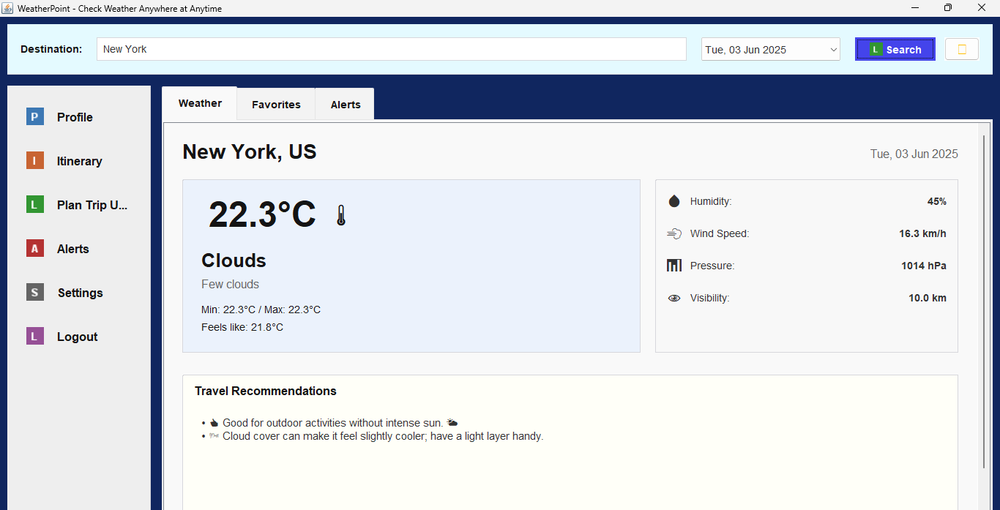

# Weather Point 

Weather Point is a Java Swing desktop application designed to provide users with current weather information, forecasts, and travel recommendations for various destinations. It features a user-friendly interface with login/registration, a dashboard to search weather, manage favorite locations, and an AI-powered trip planner.

Login Page (It might take some time to load):

<div align="center">
  
</div>

Dashboard:

 


## Features

*   **User Authentication:** Secure login and registration system.
*   **Weather Search:** Get current weather details for any city worldwide.
    *   Temperature (actual, feels like, min/max)
    *   Weather condition and description
    *   Humidity, Wind Speed, Pressure, Visibility
*   **Date Selection:** View weather for the current day or up to 7 days in advance (Note: Current OpenWeatherMap free tier mainly provides current weather; forecast display might be limited).
*   **Travel Recommendations:** Get AI-generated suggestions based on the weather conditions for your searched destination.
*   **Favorites:** Save and quickly access weather for your favorite locations.
*   **Customizable Settings:**
    *   Choose between Light and Dark themes.
    *   Select preferred temperature units (°C / °F).
    *   Select preferred wind speed units (km/h / mph).
    *   Toggle weather alert notifications (future feature).
*   **AI Trip Planner:** A simple chatbot to help plan aspects of your trip (accommodations, food, activities).
*   **Responsive UI (Basic):** The interface attempts to adjust to different window sizes.

## Technologies Used

*   **Java:** Core programming language.
*   **Swing:** For the graphical user interface (GUI).
*   **Maven:** For project build and dependency management.
*   **Apache HttpClient:** For making HTTP requests to the weather API.
*   **Jackson Databind:** For parsing JSON responses from the weather API.
*   **OpenWeatherMap API:** As the source for weather data.
*   **Gemini AI API:** For trip planner it calls the gemini api model via RestAPI (HTTP request).

## Prerequisites

Before you begin, ensure you have the following installed:

*   **Java Development Kit (JDK):** Version 11 or higher.
*   **Apache Maven:** Version 3.6 or higher.
*   **Git:** For cloning the repository.
*   **Am OpenWeatherMap API Key:** This is crucial for the application to fetch weather data.
*   **A Gemini API Key:** This is crucial for the AI trip planner chatbot to work.

## Getting Started

Follow these instructions to get a copy of the project up and running on your local machine.

### 1. Clone the Repository

```bash
git clone https://github.com/LovejeetM/WeatherPoint.git 
cd WeatherPoint
```

### 2. Obtain an OpenWeatherMap API Key

The application requires an API key from [OpenWeatherMap](https://openweathermap.org/) to fetch weather data.

*   Go to [https://openweathermap.org/appid](https://openweathermap.org/appid).
*   Sign up for a free account or log in if you already have one.
*   Navigate to the "API keys" tab in your account dashboard.
*   Copy an existing API key or generate a new one.

### 3. Configure the API Key

Once you have your API key, you need to add it to the application:

*   Navigate to the following file in the project:
    `src/main/java/com/weatherpoint/service/WeatherService.java`
*   Open `WeatherService.java` in a text editor.
*   Find the line or press [ctrl + f] and type 'akey' this line will open:
    ```java
    private static final String API_KEY = "ENTER YOUR KEY HERE - GET KEY FROM OPEN WEATHER MAP .ORG";   //    aKEY
    ```
*   Replace `"ENTER YOUR KEY HERE - GET KEY FROM OPEN WEATHER MAP .ORG"` with your actual OpenWeatherMap API key:
    ```java
    private static final String API_KEY = "xxxxxxxxxxxxxxxxxxxxxxxxxxxxxxxx"; // Your actual key
    ```
*   Save the file.

### 4. Build the Application using Maven

Maven will compile the source code, download dependencies, and package the application into a runnable JAR file.

*   Open a terminal or command prompt in the root directory of the project (the `WeatherPoint` folder).
*   Run the following Maven command:

    ```bash
    mvn clean package
    ```
    This command compiles the code into a runnable .jar file inside the target directory.

### 5. Run the Application

After the build is successful, you will find the runnable JAR file in the `target` directory.

*   The JAR file will typically be named something like `weather-point-1.0.jar` 

*   Run the application using the following command:

    ```bash
    cd target
    java -jar .\weather-point-1.0.jar 
    ```

## Project Structure

```
WeatherPoint/
├── pom.xml
└── src/
    ├── main/
        ├── java/
        │   └── com/
        │       └── weatherpoint/
        │           ├── DashboardPanel.java
        │           ├── LoginPanel.java
        │           ├── WeatherPointApp.java 
        │           ├── model/      
        │           ├── service/   
        │           └── util/    
        └── resources/
            └── icons/          
```

## Contributing

Contributions are welcome! If you'd like to contribute, please follow these steps:

1.  Fork the Project.
2.  Create your Feature Branch (`git checkout -b feature/Feature`).
3.  Commit your Changes (`git commit -m 'Add some Feature'`).
4.  Push to the Branch (`git push origin feature/Feature`).
5.  Open a Pull Request.

## Future Enhancements (Ideas)

*   Implement actual weather alert fetching and display.
*   Detailed multi-day forecasts (requires a different OpenWeatherMap API endpoint/plan).
*   Fixing theme issues.
*   More sophisticated AI for the trip planner.
*   Improved UI/UX.
